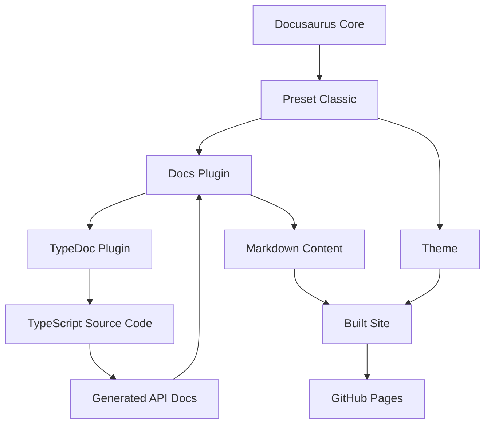

# Design Document: Docusaurus Documentation Site

## Overview

This design document outlines the implementation of a Docusaurus-based documentation site for the API Test Harness project. The documentation site will be structured as a subdirectory (`docs-site/`) within the main project, mirroring the architecture and configuration of the lambda-toolkit documentation site.

The site will provide comprehensive documentation including getting started guides, configuration references, usage examples, and auto-generated API documentation via TypeDoc. It will be deployed to GitHub Pages at https://leighton-digital.github.io/api-test-harness/.

### Key Design Decisions

1. **Separate Subdirectory**: The docs-site will be a self-contained subdirectory with its own package.json and dependencies, avoiding conflicts with the main project
2. **TypeDoc Integration**: API reference documentation will be auto-generated from TypeScript source code comments
3. **GitHub Pages Deployment**: Using Docusaurus's built-in deployment capabilities for GitHub Pages
4. **pnpm Package Manager**: Consistent with the main project's package manager choice
5. **TypeScript Configuration**: All configuration files will use TypeScript for type safety

## Architecture

### Directory Structure

```
api-test-harness/
├── docs-site/                    # Docusaurus documentation site
│   ├── src/
│   │   ├── css/
│   │   │   └── custom.css       # Custom styling
│   │   └── pages/
│   │       └── index.tsx        # Landing page (optional)
│   ├── static/
│   │   ├── .nojekyll            # GitHub Pages configuration
│   │   └── img/
│   │       └── api-test-harness-logo.png
│   ├── docs/                    # Documentation content
│   │   ├── getting-started.md
│   │   ├── installation.md
│   │   ├── configuration.md
│   │   ├── usage-examples.md
│   │   ├── seeding-data.md
│   │   ├── architecture.md
│   │   └── api-reference/       # Auto-generated by TypeDoc
│   ├── docusaurus.config.ts     # Main configuration
│   ├── sidebars.ts              # Sidebar navigation
│   ├── tsconfig.json            # TypeScript configuration
│   ├── package.json             # Dependencies and scripts
│   └── .gitignore               # Git ignore rules
├── src/                         # Existing source code (unchanged)
├── images/                      # Existing images (referenced by docs)
└── package.json                 # Main project package.json (unchanged)
```

### Component Relationships



## Components and Interfaces

### 1. Docusaurus Configuration (docusaurus.config.ts)

**Purpose**: Central configuration for the Docusaurus site

**Configuration Structure**:
```typescript
interface DocusaurusConfig {
  title: string;                    // "API Test Harness"
  tagline: string;                  // Site tagline
  favicon: string;                  // Favicon URL
  url: string;                      // "https://leighton-digital.github.io"
  baseUrl: string;                  // "/api-test-harness/"
  organizationName: string;         // "leighton-digital"
  projectName: string;              // "api-test-harness"
  onBrokenLinks: string;            // "warn"
  onBrokenMarkdownLinks: string;    // "warn"
  i18n: I18nConfig;
  presets: PresetConfig[];
  themeConfig: ThemeConfig;
}
```

**Key Configuration Sections**:

1. **Site Metadata**:
   - Title: "API Test Harness"
   - Tagline: "A CDK based API test harness for returning predefined deterministic responses"
   - Favicon: Leighton favicon URL

2. **GitHub Pages Settings**:
   - URL: https://leighton-digital.github.io
   - Base URL: /api-test-harness/
   - Organization: leighton-digital
   - Project: api-test-harness

3. **Preset Configuration**:
   - Use @docusaurus/preset-classic
   - Docs path: ./docs
   - Route base path: / (serve docs at root)
   - Disable blog feature

4. **Theme Configuration**:
   - Navbar with logo and links
   - Footer with documentation and community links
   - Prism syntax highlighting themes

### 2. Sidebar Configuration (sidebars.ts)

**Purpose**: Define the navigation structure for documentation

**Structure**:
```typescript
interface SidebarsConfig {
  docs: SidebarItem[];
}

type SidebarItem = 
  | { type: 'autogenerated'; dirName: string }
  | { type: 'category'; label: string; items: SidebarItem[] }
  | { type: 'doc'; id: string; label?: string };
```

**Navigation Structure**:
```
- Getting Started
- Installation
- Configuration
- Usage Examples
- Seeding Data
- Architecture
- API Reference (auto-generated)
```

### 3. Package Configuration (package.json)

**Purpose**: Define dependencies and scripts for the documentation site

**Dependencies**:
- @docusaurus/core: 3.9.2
- @docusaurus/preset-classic: 3.9.2
- @mdx-js/react: 3.1.1
- prism-react-renderer: 2.4.1
- react: 19.2.4
- react-dom: 19.2.4

**Dev Dependencies**:
- @docusaurus/module-type-aliases: 3.9.2
- @docusaurus/tsconfig: 3.9.2
- @docusaurus/types: 3.9.2
- typescript: 5.9.3
- typedoc: latest
- typedoc-plugin-markdown: latest

**Scripts**:
- `start`: Launch development server
- `build`: Build production site
- `serve`: Serve production build locally
- `deploy`: Deploy to GitHub Pages
- `clear`: Clear Docusaurus cache
- `typecheck`: Run TypeScript type checking
- `preinstall`: Enforce pnpm usage

### 4. TypeDoc Integration

**Purpose**: Generate API reference documentation from TypeScript source code

**Configuration** (in docusaurus.config.ts):
```typescript
{
  plugins: [
    [
      'docusaurus-plugin-typedoc',
      {
        entryPoints: ['../src/index.ts'],
        tsconfig: '../tsconfig.json',
        out: 'api-reference',
        sidebar: {
          categoryLabel: 'API Reference',
          position: 10
        }
      }
    ]
  ]
}
```

**TypeDoc Workflow**:
1. Read TypeScript source files from `../src/`
2. Parse JSDoc comments and type information
3. Generate Markdown files in `docs/api-reference/`
4. Integrate with Docusaurus sidebar navigation

### 5. Custom Styling (src/css/custom.css)

**Purpose**: Apply custom branding and styling

**CSS Variables**:
```css
:root {
  --ifm-color-primary: #2e8555;      /* Primary brand color */
  --ifm-color-primary-dark: #29784c;
  --ifm-color-primary-darker: #277148;
  --ifm-color-primary-darkest: #205d3b;
  --ifm-color-primary-light: #33925d;
  --ifm-color-primary-lighter: #359962;
  --ifm-color-primary-lightest: #3cad6e;
  --ifm-code-font-size: 95%;
  --docusaurus-highlighted-code-line-bg: rgba(0, 0, 0, 0.1);
}
```

**Custom Styles**:
- Font families (Montserrat, Euclid Circular A)
- Logo sizing and positioning
- Code block styling
- Navigation bar customization

### 6. Static Assets

**Purpose**: Serve static files like images and configuration files

**Structure**:
```
static/
├── .nojekyll              # Disable Jekyll processing on GitHub Pages
└── img/
    └── api-test-harness-logo.png
```

**Asset Management**:
- Copy logo from `../images/api-test-harness-logo.png`
- Reference images using `/img/` path in documentation
- Include .nojekyll to prevent GitHub Pages from processing with Jekyll

## Data Models

### Documentation Content Model

```typescript
interface DocumentationPage {
  id: string;                    // Unique identifier (filename)
  title: string;                 // Page title
  description?: string;          // Page description
  sidebar_position?: number;     // Position in sidebar
  hide_title?: boolean;          // Whether to hide title
  content: string;               // Markdown content
}
```

### Navigation Model

```typescript
interface NavigationItem {
  type: 'doc' | 'category' | 'link';
  label: string;
  to?: string;                   // For links
  docId?: string;                // For doc items
  items?: NavigationItem[];      // For categories
  position?: number;             // Sidebar position
}
```

### Site Configuration Model

```typescript
interface SiteConfig {
  metadata: {
    title: string;
    tagline: string;
    url: string;
    baseUrl: string;
  };
  deployment: {
    organizationName: string;
    projectName: string;
  };
  theme: {
    navbar: NavbarConfig;
    footer: FooterConfig;
    prism: PrismConfig;
  };
}
```

## 
Correctness Properties

### What are Correctness Properties?

A property is a characteristic or behavior that should hold true across all valid executions of a system—essentially, a formal statement about what the system should do. Properties serve as the bridge between human-readable specifications and machine-verifiable correctness guarantees.

For this documentation site setup, properties focus on verifying that the generated file structure, configurations, and dependencies meet the specified requirements. Since this is primarily a scaffolding and configuration task rather than runtime behavior, most properties are example-based tests that verify specific files and configurations exist with correct values.

### Properties

**Property 1: Directory Structure Completeness**
*For the* docs-site directory, all required subdirectories and files SHALL exist including src/, static/, docs/, package.json, docusaurus.config.ts, sidebars.ts, and tsconfig.json
**Validates: Requirements 1.1, 1.5, 1.7, 8.3, 10.1, 10.2**

**Property 2: Docusaurus Version Correctness**
*For the* docs-site/package.json file, the @docusaurus/core and @docusaurus/preset-classic dependencies SHALL be version 3.9.2
**Validates: Requirements 1.2, 9.4, 9.5**

**Property 3: Package Manager Configuration**
*For the* docs-site directory, a pnpm-lock.yaml file SHALL exist and the package.json SHALL include a preinstall script that enforces pnpm usage
**Validates: Requirements 1.3**

**Property 4: Required Scripts Presence**
*For the* docs-site/package.json file, the scripts section SHALL include start, build, serve, deploy, clear, and typecheck scripts
**Validates: Requirements 1.4, 7.1, 7.2, 7.3, 7.4, 7.5, 7.6**

**Property 5: GitHub Pages Deployment Configuration**
*For the* docusaurus.config.ts file, the url SHALL be "https://leighton-digital.github.io", baseUrl SHALL be "/api-test-harness/", organizationName SHALL be "leighton-digital", and projectName SHALL be "api-test-harness"
**Validates: Requirements 1.6, 5.1, 5.2, 5.3, 5.5**

**Property 6: TypeDoc Integration**
*For the* docusaurus.config.ts file, the plugins array SHALL include typedoc-plugin-markdown configuration with entryPoints pointing to ../src/ and output configured for Docusaurus compatibility
**Validates: Requirements 2.1, 2.3, 2.4, 2.5**

**Property 7: Documentation Files Existence**
*For the* docs-site/docs directory, files SHALL exist for getting-started.md, installation.md, configuration.md, usage-examples.md, seeding-data.md, and architecture.md
**Validates: Requirements 3.1, 3.2, 3.3, 3.4, 3.5, 3.6**

**Property 8: Sidebar Navigation Configuration**
*For the* sidebars.ts file, the configuration SHALL include an autogenerated sidebar that organizes documentation content
**Validates: Requirements 3.8, 6.5**

**Property 9: Branding Configuration**
*For the* docusaurus.config.ts file, the title SHALL be "API Test Harness", a tagline SHALL be present, and the navbar logo SHALL reference the API Test Harness logo
**Validates: Requirements 4.1, 4.3, 4.4, 10.5**

**Property 10: Custom Styling Presence**
*For the* docs-site/src/css directory, a custom.css file SHALL exist
**Validates: Requirements 4.2**

**Property 11: Footer Branding**
*For the* docusaurus.config.ts file, the footer configuration SHALL include Leighton branding and links to documentation and community resources
**Validates: Requirements 4.5, 6.3, 6.4**

**Property 12: Navigation Bar Links**
*For the* docusaurus.config.ts file, the navbar items SHALL include a Documentation link and a GitHub repository link
**Validates: Requirements 6.1, 6.2**

**Property 13: Static Assets Setup**
*For the* docs-site/static directory, a .nojekyll file SHALL exist and the img/ subdirectory SHALL contain the API Test Harness logo
**Validates: Requirements 5.4, 10.3, 10.4**

**Property 14: Dependency Versions**
*For the* docs-site/package.json file, dependencies SHALL include React 19.2.4, TypeScript 5.9.3, and the engines field SHALL specify Node.js >= 18.0
**Validates: Requirements 9.1, 9.2, 9.3**

**Property 15: Browserslist Configuration**
*For the* docs-site/package.json file, a browserslist field SHALL exist with production and development configurations
**Validates: Requirements 9.6**

**Property 16: Main Project Preservation**
*For the* api-test-harness root directory, the src/ directory and root package.json SHALL remain unchanged after docs-site creation
**Validates: Requirements 8.1, 8.2**

**Property 17: Image References**
*For the* docs-site configuration and static assets, the API Test Harness logo SHALL be copied from ../images/api-test-harness-logo.png to static/img/
**Validates: Requirements 8.5**

## Error Handling

### Configuration Errors

**Missing Dependencies**:
- If required npm packages are not installed, the build process will fail with clear error messages
- Solution: Run `pnpm install` in the docs-site directory

**Invalid Configuration**:
- If docusaurus.config.ts has syntax errors, Docusaurus will fail to start
- Solution: Validate TypeScript syntax and configuration structure

**TypeDoc Generation Failures**:
- If TypeDoc cannot parse source files, API documentation will not be generated
- Solution: Ensure source files have valid TypeScript syntax and JSDoc comments

### Build Errors

**Broken Links**:
- Docusaurus will warn about broken internal links during build
- Solution: Fix broken links or configure onBrokenLinks to "warn" instead of "throw"

**Missing Static Assets**:
- If referenced images don't exist, the build will succeed but images won't display
- Solution: Ensure all referenced assets exist in the static/ directory

**TypeScript Type Errors**:
- If configuration files have type errors, the typecheck script will fail
- Solution: Fix type errors or update TypeScript configuration

### Deployment Errors

**GitHub Pages Configuration**:
- If baseUrl or url are incorrect, deployed site will have broken links
- Solution: Verify GitHub Pages settings match docusaurus.config.ts

**Build Output Issues**:
- If build/ directory is not generated, deployment will fail
- Solution: Run `pnpm build` before deploying

## Testing Strategy

### Dual Testing Approach

This feature requires both unit tests and example-based tests to ensure comprehensive coverage:

- **Unit Tests**: Verify specific configuration values, file existence, and structure
- **Example Tests**: Validate that specific files and configurations are created correctly

### Unit Testing

Unit tests will focus on:

1. **File Existence Tests**: Verify all required files and directories are created
2. **Configuration Validation Tests**: Parse and validate configuration files
3. **Dependency Version Tests**: Check package.json for correct versions
4. **Script Presence Tests**: Verify all required npm scripts exist
5. **Integration Tests**: Build the documentation site and verify output

### Example-Based Testing

Example tests will validate:

1. **Specific Configuration Values**: Check exact values in docusaurus.config.ts
2. **File Content Validation**: Verify configuration files have correct structure
3. **Asset Copying**: Ensure logo and static files are in correct locations
4. **Build Success**: Run build command and verify it completes without errors

### Testing Framework

- **Test Framework**: Jest (already configured in main project)
- **Test Location**: `api-test-harness/tests/docs-site-setup.test.ts`
- **Test Execution**: Run via `npm test` in main project

### Test Coverage Goals

- 100% coverage of configuration file creation
- 100% coverage of required file existence
- 100% coverage of dependency version validation
- Successful build execution test

### Manual Testing

After automated tests pass, manual verification should include:

1. Run `pnpm start` in docs-site and verify site loads
2. Navigate through all documentation pages
3. Verify logo and branding display correctly
4. Check that API reference documentation is generated
5. Test build and deploy commands
6. Verify deployed site on GitHub Pages

### Continuous Integration

The documentation site build should be integrated into CI/CD:

1. Add docs-site build step to GitHub Actions workflow
2. Verify build succeeds on all pull requests
3. Automatically deploy to GitHub Pages on main branch merges
4. Run link checking to catch broken links early
